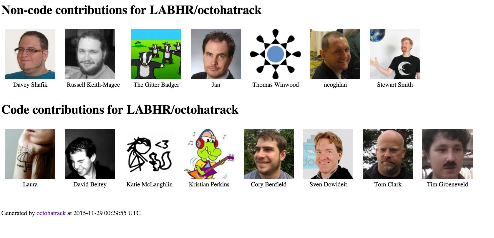

# octohatrack

[](https://travis-ci.org/labhr/octohatrack)
[]()
[]()
[]()
[]()

It's easy to see your direct [code contributions](https://help.github.com/articles/why-are-my-contributions-not-showing-up-on-my-profile/)
on GitHub, but what about everything else?

**Octohatrack** takes a github repo name, and returns a list of every
github user that has interacted with a project, but has not committed
code.

Interactions include:

-   raising or commenting on an issue
-   raising or commenting on a pull request
-   commenting on a commit

"Let's All Build a Hat Rack" ([\#LABHR](https://twitter.com/search?q=%23LABHR&src=typd)) is an
original concept by [Leslie Hawthorn](http://hawthornlandings.org/2015/02/13/a-place-to-hang-your-hat/)

Read more about octohatrack:

-   [A tool for tracking non-code GitHub contributions](https://opensource.com/life/15/10/octohatrack-github-non-code-contribution-tracker) on OpenSource.com
-   [Acknowledging Non-Coding Contributions](https://modelviewculture.com/pieces/acknowledging-non-coding-contributions) on ModelViewCulture.com
-   [Build a Better Hat Rack: All Contributions Welcome](https://www.youtube.com/watch?v=wQxFKxbWcFM) from KiwiPyCon (YouTube video)
-   [Read about the project name change](http://glasnt.com/blog/2015/11/21/goodbye-octohat.html)

## Installation

```
pip install octohatrack
```

## Usage

```
usage: octohatrack.py [-h] [-g] [-l LIMIT] [-c] [-n] [--no-cache] repo_name

positional arguments:
  repo_name             githubuser/repo

optional arguments:
  -h, --help            show this help message and exit
  -g, --generate-html   Generate output as HTML
  -l LIMIT, --limit LIMIT
                        Limit to the last x Issues/Pull Requests
  -c, --show-contributors
                        Output the code contributors
  -n, --show-names      Show the user's display name
  --no-cache            Disable local caching of API results

```

Define an environment variable for `GITHUB_TOKEN` to use an [authentication token](https://help.github.com/articles/creating-an-access-token-for-command-line-use/) to avoide being [Rate Limited](https://developer.github.com/v3/#rate-limiting)
to 60 requests per hour (allows for deeper searching).


## Run this repo locally

```
git clone https://github.com/labhr/octohatrack
cd octohatrack
python3 octohatrack.py [arguments]
```

## Run octohatrack in a Docker container

```
git clone https://github.com/labhr/octohatrack
cd octohatrack
docker build -t octohatrack .
docker run -e GITHUB_TOKEN octohatrack [arguments]
```

## Example output

```
Collecting contributors...
Collecting commentors............................................................................................................................................................................................

Code contributions: 9
alicetragedy (Laura)
davidjb (David Beitey)
glasnt (Katie McLaughlin)
kristianperkins (Kristian Perkins)
Lukasa (Cory Benfield)
mfs (Mike Sampson)
SvenDowideit (Sven Dowideit)
tclark (Tom Clark)
timgws (Tim Groeneveld)

Non-code contributions: 8
dshafik (Davey Shafik)
edunham (E. Dunham)
freakboy3742 (Russell Keith-Magee)
gitter-badger (The Gitter Badger)
jniggemann (Jan)
Ketsuban (Thomas Winwood)
ncoghlan
stewart-ibm (Stewart Smith)

Generated HTML representation, saved to LABHR_octohatrack_contrib.html
```




## Debugging

### Cache

As of octohatrack 0.3.0, there is now a cache that gets created. 
Any time an external API call is made, it gets saved to a local
cache file so that any subsequent calls don't have to burn an API call.

You can disable the cache by using the `--no-cache` flag. 

To reset the cache, remove the `cache_file.json` file.

If you experience ongoing issues with the caching,
please [log a detailed issue describing what you're seeing](https://github.com/LABHR/octohatrack/issues/new)


## To do

-   include merge-only contributors as non-code contributors
-   verify cprrect statistics from repos with multi-person Pull Requests

## Code of Conduct

Octohatrack operates under a [Code of
Conduct](https://github.com/labhr/octohatrack/blob/master/code-of-conduct.md).

## License

Octohatrack is distributed under the [MIT license](https://github.com/labhr/octohatrack/blob/master/LICENSE).

Octohub is Copyright (c) 2013 Alon Swartz (turnkeylinux), used inline under the GPLv3 license.

This project is not affiliated with GitHub.
